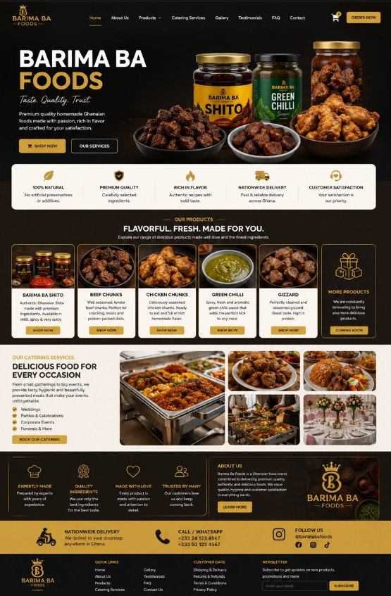

# Barima Ba Foods — Premium Ghanaian Provisions & Catering

> **Taste. Quality. Trust.**  
> Premium quality homemade Ghanaian foods made with passion, rich in flavor and crafted for your satisfaction.

---

## 🎨 Official Brand & Layout Design



---

## 🚀 Overview

**Barima Ba Foods** (formerly Provision Shop) is a state-of-the-art e-commerce storefront and admin management system built for high-performance delivery of Ghanaian provisions, artisanal shito, seasoned meats, and catering services across Accra, Ghana.

The platform features:
- **Cinematic Ambient Hero Media**: Admin-controllable hero section supporting custom 4K background videos (including `Shito animi.mp4`), HTML5 playback controls (Play/Pause, Mute/Unmute, Fullscreen), dynamic badges, and customizable headlines.
- **Glassmorphism UI System**: Dual-mode (Light Ivory Glass & Dark Obsidian Glass) luxury design system with frosted backdrop blurs (`backdrop-blur-xl`), animated shimmer typography, and an ambient **Spicy African Backdrop** texture.
- **Real-Time Admin Dashboard**: `/admin/hero` suite for 1-click video preset switching, custom video URL updates, copy editing, and live preview.
- **Full E-Commerce Stack**: Product catalog, shopping cart, customer checkout, rider delivery tracking, and order history backed by Supabase PostgreSQL RLS security.

---

## 📦 Key Product Categories

1. **Barima Ba Shito**: Authentic Ghanaian Shito made with premium ingredients. Available in Mild, Spicy & Very Spicy.
2. **Beef Chunks**: Well-seasoned, tender beef chunks perfect for snacking, meals, and protein-packed diets.
3. **Chicken Chunks**: Deliciously seasoned chicken chunks ready to eat with rich homemade flavor.
4. **Green Chilli**: Spicy, fresh and aromatic green chili sauce that adds the perfect kick to any meal.
5. **Gizzard**: Perfectly cleaned and seasoned gizzard with great taste and high protein.

---

## 🍽️ Catering Services

Barima Ba Foods provides full-service catering for all occasions across Accra:
- 💍 **Weddings**
- 🎉 **Parties & Celebrations**
- 🏢 **Corporate Events**
- 🕊️ **Funerals & Special Gatherings**

---

## 🛡️ Value Commitments & Trust Badges

- 🌿 **100% Natural**: No artificial preservatives or additives.
- 🛡️ **Premium Quality**: Carefully selected local ingredients.
- 🔥 **Rich in Flavor**: Authentic Ghanaian recipes with bold taste.
- 🚚 **Nationwide & Accra Delivery**: Fast & reliable delivery across Ghana (Same-day in Accra, 30–60 min in East Legon & Spintex).
- 🤝 **Customer Satisfaction**: Quality guaranteed on every order.

---

## 🛠️ Technology Stack

- **Frontend**: React, Vite, TanStack Router, TanStack Query, Tailwind CSS, Lucide Icons
- **Backend / Database**: Supabase PostgreSQL, Row Level Security (RLS), Server Functions
- **Styling**: Vanilla CSS tokens, Tailwind glassmorphic backdrop utilities, Custom `@keyframes shimmer` & `@keyframes slowPan`
- **Media Engine**: HTML5 Video element with custom overlay controls, adaptive fallbacks, and poster caching

---

## 💻 Local Development

```bash
# Install dependencies
npm install

# Run dev server with hot reload
npm run dev

# Build production bundle
npm run build
```

---

## 📞 Contact & Support

- **Phone / WhatsApp**: +233 24 123 4567 | +233 50 123 4567
- **Social Media**: `@barimabafoods` (Instagram, Facebook, TikTok)
- **Location**: Accra, Ghana
